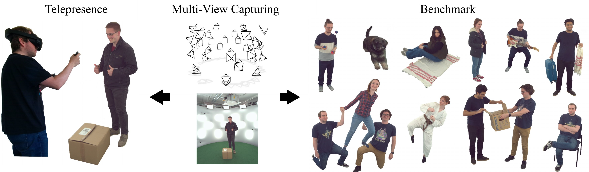

<p align="center">
<h1 align="center"> RIFTCast: A Template-Free End-to-End Multi-View Live Telepresence Framework and Benchmark</h1>

<h3 align="center">Domenic Zingsheim · Markus Plack · Hannah Dröge · Janelle Pfeifer · Patrick Stotko · Matthias B. Hullin · Reinhard Klein <br> University of Bonn </h3>
<h3 align="center">ACM Multimedia 2025</h3>
<h3 align="center"> <a href=https://cg.cs.uni-bonn.de/publication/zingsheim-2025-riftcast>Project Page</a> &nbsp; | &nbsp; <a href=https://doi.org/10.1145/3746027.3754789>Paper</a> </h3>
</p>

<p align="center">
  
</p>

This repository contains our source code of the paper "RIFTCast: A Template-Free End-to-End Multi-View Live Telepresence Framework and Benchmark".

## Abstract

<p align="justify">
Immersive telepresence aims to authentically reproduce remote physical scenes, enabling the experience of real-world places, objects and people over large geographic distances. This requires the ability to generate realistic novel views of the scene with low latency. Existing methods either depend on depth data from specialized hardware setups or precomputed templates such as human models, which severely restrict their practicality and generalization to diverse scenes. To address these challenges, we introduce RIFTCast, a real-time template-free volumetric reconstruction framework that synthesizes high-fidelity dynamic scenes from a multi-view RGB-only capture setup. The framework is specifically targeted at the efficient reconstruction, transmission and visualization of complex scenes, including extensive human-human and human-object interactions. For this purpose, our method leverages a GPU-accelerated client-server pipeline that computes a visual hull representation to select a suitable subset of images for novel view synthesis, substantially reducing bandwidth and computation demands. This lightweight architecture enables deployment from small-scale configurations to sophisticated multi-camera capture stages, achieving low-latency telepresence even on resource-constrained devices. For evaluation, we provide a comprehensive high-quality multi-view video data benchmark as well as our reconstruction and rendering code, including tools for loading and processing a variety of data input formats, to facilitate future telepresence research.
</p>

## Prerequisites

This framework is primarily tested on Windows using MSVC. For Linux, gcc is recommended. Additional dependencies needed for building the project are [CMake>=3.27](https://cmake.org), [Python>=3.9](https://www.python.org), [CUDA>=12.1](https://developer.nvidia.com/cuda-toolkit), and [pytorch2.4.0](https://pytorch.org) with the same CUDA version as your global CUDA installation. 

On Windows, you have to 
include `<PATH_TO_PYTHON>/Lib/site-packages/torch/lib` into your `PATH` variables

## Building

After cloning the repository, clone the submodules via
```
git submodule update --init --recursive
```

Then, configure a preset (see Targets)
```
cmake --preset <target_name>-<Release|Debug>
```

and build it
```
cmake --build --preset <target_name>-<Release|Debug> --parallel
```

## Targets
* RIFTCast_app - Standalone reconstruction App. This runs locally on your machine and prompts you to open a dataset. When a VR headset is connected and Steam VR is running, it will automatically run in VR (see VR). This target will perform reconstructions without inpainting (see Inpainting).
* RIFTCast_server - Runs the server with two GPUs (see Server).
* RIFTCast_client - Runs the remote client. Like the App, it will automatically run in VR if a headset is connected and Steam VR is running.
* RIFTCast_exporter - Can be used to write reconstruction results to disk (see Exporter).

## Dataset

The RIFTCast dataset can be downloaded [here](https://cg.cs.uni-bonn.de/publication/zingsheim-2025-riftcast).

Datasets are loaded using config files:

### Dataset Meta File
```json
{
    "type": "VCI", // Which type of dataset
    "version": "2.2",
    "dataset": {
        "frame_count": 150,     // used for datasets loaded from disk
        "start_frame": 0,       // used for datasets loaded from disk
        "path": "",             // used for datasets loaded from disk
        "camera_path": "",      // relative to "path", used for datasets loaded from disk
        "flip_images": true,    // If Input images should be flipped
        "flip_masks": true,     // If masks should be flipped
        "to_world": [           // Object to world-space transformation
            1, 0, 0, 0,
            0, 1, 0, 0,
            0, 0, 1, 0,
            0, 0, 0, 1
        ]
    },
    "reconstructor": {
        "level": 9,             // Level of visual hull grid
        "partial_masks": true,   // If partial masks should be used for the visual hull
        "gpu": 1,                // GPU used by the Reconstruction Module (Server only)
        "smoothing": true,      // If masks should be smoothed
        "kernel_size": 9,       // Kernel size for smoothing
        "sigma": 2.0            // Sigma for smoothing
    },
    "volume": {
        "position": [0, 1.5, 0],    // Position of the reconstruction volume (center)
        "scale": 1.5                // Scale of the volume (half side length)
    },
    "server": {
        "ip": "127.0.0.1",          // Ip and port of reconstruction server (RIFTCast_server)
        "port": 25565
    },
    "renderer": {
        "gpu": 0 // Which GPU should be used by the Renderer module (Server only)
    },
    "inpainting": {
        "enable": true, // If inpainting should be enabled
        "path": "ABSOLUTE_PATH_TO_REPO/inpainting" // Path to compiled inpainting modules
    }
}
```
The types are defined by
```c++
    enum class DatasetType
    {
        VCI     = 4,    // Currently only one supported (see below)
    };
```
The data should be structured like this:

```
dataset_name/
├── calibration.json        # Calibration file with intrinsic/extrinsic parameters
├── frame_00000/            # Frame folder (can be repeated for each time/frame index)
│   ├── rgb/                # RGB images for this frame
│   │   ├── rgb_0.jpeg      # RGB image 0
│   │   ├── rgb_1.jpeg      # RGB image 1
│   │   └── ...             # Additional RGB images
│   └── mask/               # Corresponding binary masks
│       ├── mask_0.bin      # Binary mask 0
│       ├── mask_1.bin      # Binary mask 1
│       └── ...             # Additional binary masks
├── frame_00001/
│   ├── rgb/
│   │   ├── rgb_0.jpeg
│   │   ├── rgb_1.jpeg
│   │   └── ...
│   └── mask/
│       ├── mask_0.bin
│       ├── mask_1.bin
│       └── ...
└── ...                     # More frame directories follow the same structure
```

Notes:
- Each `frame_xxxxx/` directory contains a synchronized set of RGB images and corresponding masks.
- The naming (`rgb_*.jpeg`, `mask_*.bin`) must be consistent for indexing purposes with the camera ids in `calibration.json`.
- `calibration.json` provides camera parameters and should be used for 3D reconstruction or sensor alignment tasks.
- Masks images are in compressed form using [maskcompression](https://github.com/DerAndereDomenic/maskcompression).

Calibration file
```json
{
  "cameras": [
    {
      "camera_id": 0,
      "extrinsics": {
        "view_matrix": [
          0.9188561554738048,
          -0.35288937530265624,
          0.17655722683141506,
          -0.4215528027134117,
          0.12128194453000071,
          -0.1732111371771056,
          -0.9773886595867766,
          2.5001061297864164,
          0.37549175154578357,
          0.9194927899425396,
          -0.11635700995111783,
          2.859515562587755,
          0.0,
          0.0,
          0.0,
          1.0
        ] // 4x4 world to camera space matrix
      },
      "intrinsics": {
        "camera_matrix": [
          2284.065103448421,
          0.0,
          1327.357424112301,
          0.0,
          2283.846407026684,
          1134.1948182363674,
          0.0,
          0.0,
          1.0
        ], // opencv camera matrix
        "resolution": [
          2664.0,
          2304.0
        ]
      },
      "camera_model_name": "C0000"
    },
    ...]
...}
```

## VR

To use the RIFTCast_client and RIFTCast_app with VR, you have to use a Windows machine, install the necessary drivers (e.g. Meta Quest Link), install SteamVR, connect your Headset to the PC and run the application.

## Inpainting (Linux Only)

We use the real-time video Inapinting algorithm by [Thiry et al.](https://github.com/guillaume-thiry/towards-online-video-inpainting). By running
```
python compile_inpainting.py
```
the compiled models will be written to `./inpainting`. As additional depencies, you have to install

* gdown
* gitpython

Inpainting is only available under Linux, when using the RIFTCast_server. RIFTCast_app will not apply any inpainting and RIFTCast_exporter only if specified (and available).

After compilation, set the path to the inpainting folder in the datasets config files.

## Server

Configure and compile the server
```
cmake --preset RIFTCast_server-<Debug|Release>
```

```
cmake --build --preset RIFTCast_server-<Debug|Release> --parallel
```

Run the server:
```
./bin/RIFTCast_server <path_to_dataset_config>
```

## Client

Run the client with the following options

```
./RIFTCast_client

Options:
--skybox {true|false}   If a skybox should be loaded (Default: true)
--cameras {true|false}  If the cameras should be rendered (Default: true)
--cad_grid {true|false} If the cad grid should be rendered (Default: true)
```
when running the client, it expects a config file with information about the server:

```
{
	"version": 1.0,
    "server": {
        "ip": "SERVER-IP",
        "port": 25565
    }
}
```

## Exporter

The RIFTCast_exporter target can be used to render still frames from each cameras point of view and export them to disk.

```
./RIFTCast_exporter --dataset <dataset_path> --output <output_path>

Options:
--exclude_nearest {true | false} If the nearest camera should be excluded for texture reconstruction (Default: false)
--inpaint {true | false} If inpainting should be performed (linux only) (Default: true)
--test_only {true | false} If only test views should be rendered (Default: false)
--background [r,g,b,a] Background color (Default: [1,1,1,1])
--calibration <path> Override the calibration file (optional)
--test_file <path> Define a set of test cameras (optional)
--frame <int> Only render a specific frame (optional)
```

## Citation

```
@inproceedings{zingsheim2025riftcast,
	title = {RIFTCast: A {Template}-{Free} {End}-to-{End} {Multi}-{View} {Live} {Telepresence} {Framework} and {Benchmark}},
	author = {Zingsheim, Domenic and Plack, Markus and Dr{\" o}ge, Hannah and Pfeifer, Janelle and Stotko, Patrick and Hullin, Matthias B. and Klein, Reinhard},
	booktitle = {ACM {Multimedia}},
	year = {2025},
	month = {8},
	doi = {10.1145/3746027.3754789},
}
```

## License
The software is provided under MIT license. See [LICENSE](LICENSE) for more information. 

## Acknowledgements

This work has been funded by the Ministry of Culture and Science North Rhine-Westphalia under grant number PB22-063A (InVirtuo 4.0: Experimental Research in Virtual Environments), and by the state of North Rhine Westphalia as part of the Excellency Start-up Center.NRW (U-BO-GROW) under grant number 03ESCNW18B.